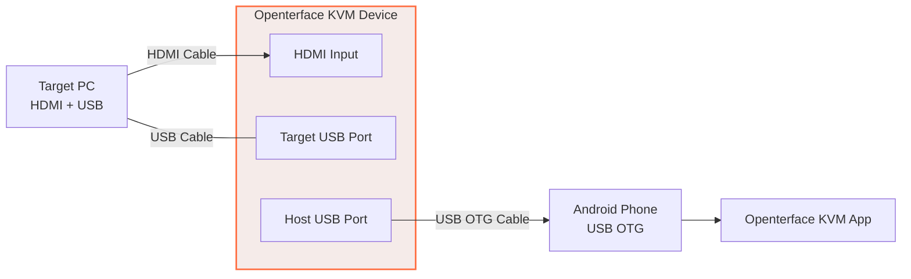
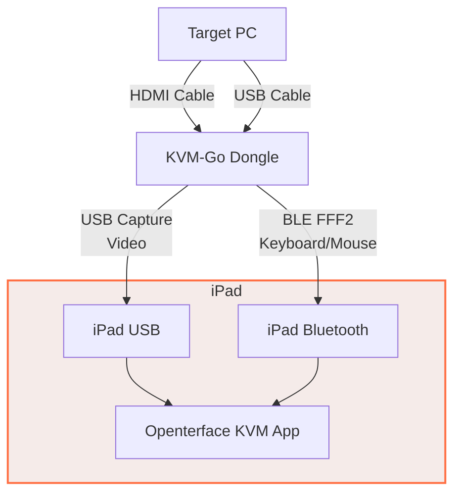

# KVM Tutorial 01 — Getting Started

**Audience:** Beginners — first-time users of Openterface KVM devices

---

## 1. What Is a KVM-over-USB?

A KVM (Keyboard, Video, Mouse) device sits between your **host computer** (your workstation) and a **target computer** (server, mini PC, embedded device). It:

- **Captures** the target's HDMI video output (and audio, if available)
- **Relays** your keyboard and mouse input through HID emulation
- All over a single USB cable — no network required

This is what sets KVM devices apart from remote desktop software: you can control the target even in **BIOS/UEFI**, during boot, or when the OS has crashed.

### Openterface KVM Devices

| Device | Form Factor | Key Feature |
|--------|------------|-------------|
| [Mini-KVM](https://openterface.com/minikvm/?utm_source=docs) | Mini connection hub style | KVM over USB, switchable USB port |
| [KVM-Go](https://openterface.com/kvmgo/?utm_source=docs) | Compact video dongle | Built-in video connector, compact design, 4K in / 4K out support, switchable SD card |
| [uConsole KVM Extension v2](https://openterface.com/kvmext/?utm_source=docs) | Internal module | Built-in KVM + Ethernet + SD for ClockworkPi uConsole |

> Looking for **KeyMod** (keyboard & mouse emulator only, no video)? See the [KeyMod Tutorial](../../keymod/index.md).

---

## 2. What You Need

### Hardware

- **Openterface KVM device** — Mini-KVM, KVM-Go, or uConsole KVM Extension
- **Host computer** — Running macOS, Windows, Linux, or Android
- **Target computer** — Any computer with HDMI output
- **HDMI cable**
  - Mini-KVM / uConsole KVM Extension v2 — From target's HDMI output to the KVM's HDMI input
  - KVM-Go — Not required, has a built-in video connector
- **USB Type-C cable** — From KVM to your host computer (provides both power and data)
  - Mini-KVM Basic / uConsole KVM Extension — Required, not bundled
  - KVM-Go / Mini-KVM Toolkit version — Bundled with cables
  - If purchasing separately, use a high-quality USB 2.0 or 3.0 Type-C cable

---

## 3. Installation

### Host Application

| Platform | Application | Download |
|----------|------------|----------|
| **Windows** | Openterface QT | [GitHub Releases](https://github.com/TechxArtisanStudio/Openterface_QT/releases) (installer or portable exe) |
| **macOS** | Openterface for macOS | [App Store](/appstore) or [DMG](app/mmacos/dmg-installation.md) |
| **Linux** | Openterface QT | [Flatpak](https://flathub.org/apps/com.openterface.openterfaceQT), [GitHub Releases](https://github.com/TechxArtisanStudio/Openterface_QT/releases) (.deb, .rpm, .pkg.tar.zst, AppImage) |
| **Android** | Openterface for Android | [Google Play](https://play.google.com/store/apps/details?id=com.openterface.AOS) or [GitHub Releases](https://github.com/TechxArtisanStudio/Openterface_Android/releases) |
| **iPadOS** | Openterface for iPadOS | [App Store](/app/ipados/) — **KVM-Go only** |

### Windows

- The installer bundles the CH340 serial driver. For portable builds, install it separately.
- **Camera permission** — Go to **Settings > Privacy & security > Camera** and enable camera access for desktop apps. The KVM device appears as a USB camera for video capture

### macOS Permissions

On first launch, macOS will request:

| Permission | Why |
|-----------|-----|
| **Camera** | Captures video from the HDMI capture chip |
| **Microphone** | Captures audio from the target (if enabled) |
| **Accessibility** | Required for HID mouse control in Relative mode |

### Linux Permissions

- Add your user to the required groups:
  - **Debian/Ubuntu/Fedora/RHEL:** `sudo usermod -a -G dialout,video $USER`
  - **Arch Linux:** `sudo usermod -a -G uucp,video $USER` (Arch uses `uucp` instead of `dialout` for serial devices)
- Install udev rules for device access (bundled in `.deb`, `.rpm`, `.pkg.tar.zst` packages). Modern systems with systemd use `uaccess` tags to automatically grant device permissions to the logged-in user
- **BrlTTY conflict:** Remove `brltty` or blacklist the serial chip — see [Troubleshooting](04-troubleshooting.md#brltty-conflict-linux)
- **Arch Linux users:** See the [Arch Linux Installation Guide](../../app/qt/archlinux-installation.md) for full setup instructions

### Android Requirements

The Android app requires:

- **Android 5.0 (API 21)** or later
- **USB OTG support** — most modern phones support it (Samsung, Google Pixel, OnePlus). Verify by connecting a USB flash drive with an OTG adapter
- **USB OTG cable or adapter** to connect the KVM device to your phone

### iPadOS Requirements

The iPadOS app requires:

- **iPadOS 17.2** or later
- **KVM-Go device** — iPadOS connects to the KVM-Go dongle via **Bluetooth Low Energy (BLE)** for keyboard/mouse input, and the USB capture card for video
- **Camera and Microphone permissions** — needed for video preview and audio monitoring from the capture card
- **Bluetooth permission** — required to discover and connect to the KVM-Go dongle for HID input
- **Photo Library permission** (optional) — to save screenshots and recordings to the Photos app

---

## 4. Connecting the Hardware

  

    <h4>Host Side</h4>
    
    

      <strong>① Host USB</strong> — Connects to your host computer 
      <strong>④ Switchable USB</strong> — For keyboard/mouse emulation 
      <strong>⑤ Toggle Switch</strong> — Switch between host/target control
    

  

  

    <h4>Target Side</h4>
    
    

      <strong>② Target USB</strong> — Connects to target computer 
      <strong>③ HDMI Input</strong> — Receives video from target
    

  

1. Connect the target's **HDMI output** to the KVM's **HDMI input**
2. Connect the KVM's **Host USB** to your **host computer's USB port** using the USB Type-C cable
3. Connect the KVM's **Target USB** to the **target computer's USB port**

### Device Detection

The KVM enumerates as multiple USB devices:
- **Video capture** (MS2109/MS2109S/MS2130S) — appears as a webcam
- **Serial** (CH340) — `/dev/ttyUSB*` (Linux), `COM*` (Windows), `cu.usbserial-*` (macOS)
- **Serial** (CH32V208) — `/dev/ttyACM*` (Linux), `COM*` (Windows), `cu.usbserial-*` (macOS)
- **HID** — used for camera control and firmware operations

### Connecting via Android Phone

When using the Android app, the connection chain uses USB OTG:

Connection order for Android:

1. **HDMI:** Connect target's HDMI output to the KVM's HDMI **input**
2. **USB (target):** Connect target's USB port to the KVM's USB port — carries mouse/keyboard signals
3. **USB OTG (phone):** Connect the KVM to your Android phone via USB OTG cable/adapter

When connected successfully, the video preview switches from a placeholder to the target's live screen, and tapping the phone screen moves the cursor on the target.

### Connecting via iPadOS

The iPadOS app uses a different connection model: **BLE for input** and **USB capture for video**.

Connection order for iPadOS:

1. **Hardware:** Plug the KVM-Go dongle into the target PC's HDMI/VGA/DP port and connect the Target USB to Target Computer USB port, then HOST USB to Host Computer USB Port
2. **Power on** the target computer
3. **Open the app** on your iPad and grant camera, microphone, and Bluetooth permissions
4. **Tap the BLE button** in the toolbar — the app scans for devices named `kvm*`
5. **Tap Connect** next to your KVM-Go device — the button turns green with RSSI signal strength
6. **Verify:** the video preview shows the target's screen, tapping sends clicks, typing sends keystrokes

> **Note:** The iPadOS app only works with **KVM-Go**. Mini-KVM and uConsole KVM Extension do not have BLE support.

---

## 5. First Launch

### Android Permissions

On first launch, the Android app requests:

| Permission | Why | What Happens If Denied |
|---|---|---|
| **USB Host** | Communicate with the Openterface hardware | App can't detect your KVM device |
| **Camera** | Receive video from the HDMI capture chip | No video preview |
| **Storage** | Save screenshots and recordings | Can't save captures |

Grant all permissions for full functionality. A system USB permission dialog also appears when the KVM device is detected — tap **Allow**.

### iPadOS Permissions

On first launch, the iPadOS app requests:

| Permission | Why | What Happens If Denied |
|---|---|---|
| **Camera** | Receive video from the HDMI capture card | No video preview |
| **Microphone** | Monitor target PC audio through iPad speakers | No audio monitoring |
| **Bluetooth** | Discover and connect to KVM-Go for HID input | Can't send keyboard/mouse input |
| **Photo Library** | Save screenshots and recordings | Captures still save to app Documents folder |

If you accidentally denied a permission, go to **Settings > Privacy & Security** to re-enable it.

### Verifying Connection

- **HDMI indicator:** green = signal detected, orange = no signal, gray = unknown
- **Keyboard indicator:** green = connected, orange = not found, gray = unknown
- **Mouse indicator:** green = connected, orange = not found, gray = unknown
- **Serial port:** should show a port name and baud rate (9600 or 115200)

If indicators show orange or gray, see [Troubleshooting](04-troubleshooting.md).

---

## 6. Basic KVM Control

### Mouse Modes

| Mode | Description | Best For |
|------|-------------|----------|
| **Absolute** (default) | Host cursor maps directly to target screen | General use, GUI navigation |
| **Relative (HID)** | Mouse movements sent as deltas via HID | Gaming, fast-paced interaction |

Switch via the toolbar toggle or **Control > Mouse Mode**.

### Keyboard Input

All keystrokes are forwarded to the target whenever the app window is focused:
- Standard keys, function keys, modifiers
- Special keys: Ctrl+Alt+Del, Print Screen
- **Paste to Target:** Sends clipboard text as emulated keystrokes

### USB Switching

Toggle the USB switchable port between:
- **Host** — your keyboard/mouse controls the host computer
- **Target** — your keyboard/mouse controls the target computer

---

## 7. Next Steps

- **[Basic Operations →](02-basic-operations.md)** — Mouse, keyboard, video, audio, recording
- **[Advanced Features →](03-advanced-features.md)** — EDID, firmware, macros, scripts
- **[Troubleshooting →](04-troubleshooting.md)** — Common problems and solutions
